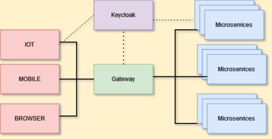
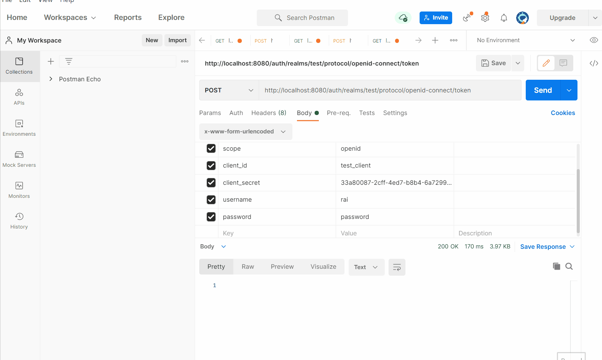
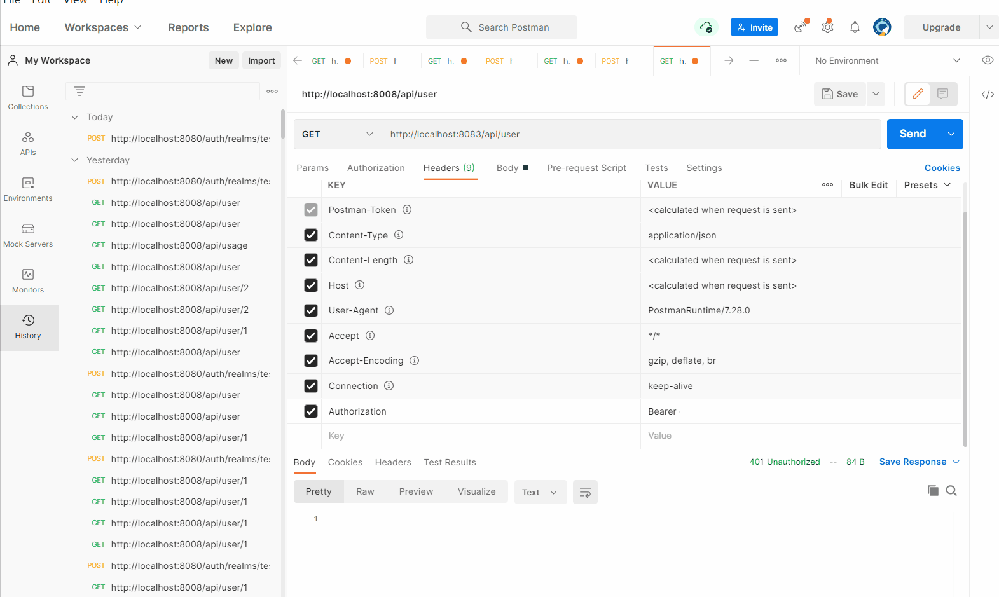
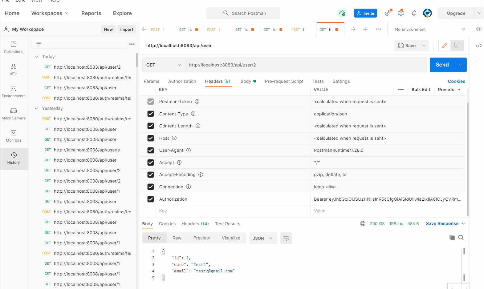
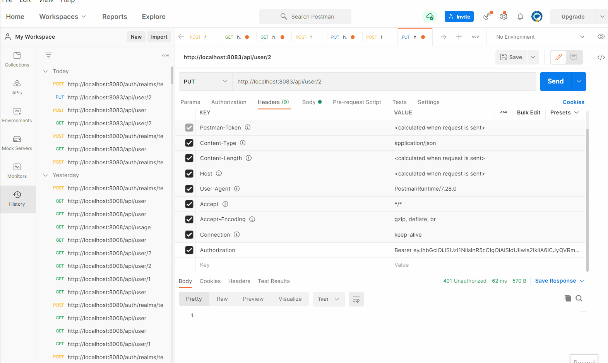
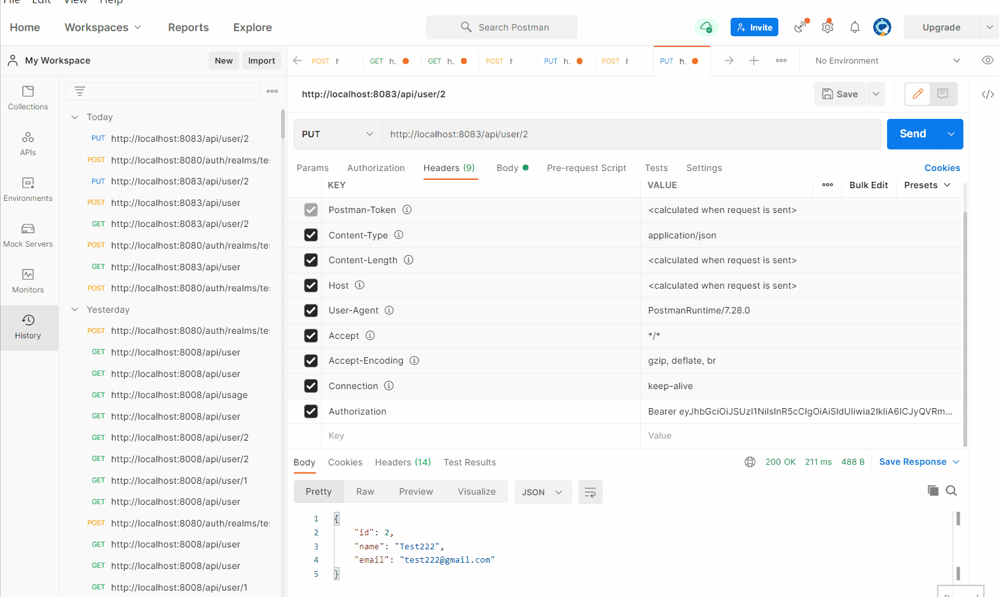
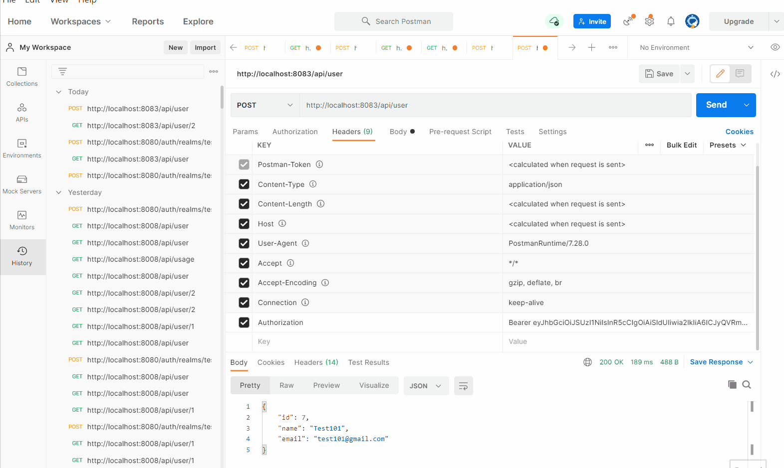

# Webflux User Information Rest Api + GateWay + OAuth + Keycloak  
In this project, we have gateway to route the request to specific microservice with provide the JWT token from the Keycloak server. We are using keycloak server for providing the jwt token , which is validate in gateway and rest api also.  

## Overview Diagram 

 

### Port details for all containers  
 
|  Containers Name  | Port          | Descrition            |
| -------------     |:-------------:| --------------------: |
| postgres          | 5432          | Postgres DB           |
| keycloak          | 8080          | Keycloak Server       |
| `gatewayapplication`| `8008`          | `Gateway Api`           |
| `userinfo`          | `8083`          | `User info (Microservice)`|

### Postman screen shot
#### keycloak JWT token
*Request Body contains*:-  
 * grant_type:password
 * scope:openid
 * client_id:test_client
 * client_secret:33a80087-2cff-4ed7-b8b4-6a7299e96b42
 * username:rai
 * password:password

 

 
 

*get all the user info*
 

 

 

*get user info*
 

 

 

*create user info*
 

 

 

*update the user info*
 

 

 

*delete user info*
 

 

 

*UnAuthorized Token*
 

 

 

## OAuth2KeycloakLib jar location 
https://nitinraidev.jfrog.io/ui/native/nitin-gradle-dev/com/nitin/oauth2/lib/OAuth2KeycloakLib/0.0.1-SNAPSHOT/
 
https://github.com/nitinrai17/OAuth2KeycloakLib

 

## Docker Command 
you need to setup jfrog cloud artifactory and provide the credential in the gradle.properties file.(https://jfrog.com/start-free/)  
 

###  Build and Run command 
`
 docker-compose up  --build 
`
 

## Keycloak UI
`
	http://localhost:8080
	
### Keycloak login screen
username: admin  
password: admin  
 
	
  

### Keycloak create realm 
 
	
  

### Keycloak create client
 
	
  

### Keycloak create role and user
 
	
  

